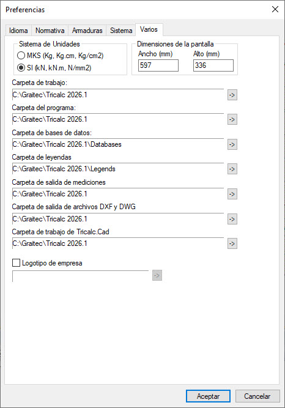

### Carpetas de almacenamiento de la estructura
- Las estructuras se guardan, almacenan, en carpetas que llevan estampada la letra **T**
- Para trabajar en una estructura, es recomendable que la carpeta que la contiene esté localizada en el disco duro donde se ejecuta el programa
  - Por defecto se guardan en: **(C:)>Graitec>Tricalc 2026.1>Nombre de la carpeta**
    - Pero cuando creas una nueva estructura puedes personalizar la ruta de almacenamiento
- No olvidar hacer una copia de seguridad de la carpeta de la estructura en un disco duro externo

### Autoguardado
- Cada vez que se abre una estructura se crea automáticamente una copia de seguridad de la misma.
  - esta copia se localiza en la misma carpeta de la estructura
  - y tiene por nombre **Backup**
  - desde **Archivo>AutoGuardar** podemos indicar si se guarda:
    - la **Estructura completa**
    - o bien **Sólo los archivos de geometría**
- Mientras se trabaja en una estructura
  - podemos hacer que el programa autoguarde la estructura cada tantos minutos
    - marcando la casilla **Activo** desde **Archivo>AutoGuardar**

### Guardar
- Para almacenar en disco la estructura actual, debemos ir a:
  - **Archivo>Guardar**
- En Tricalc **no** existe la opción **Guardar como**
  - si queremos cambiar el nombre de una estructura, debemos:
     - **Archivo>Guardar**
     - y después cambiar el nombre de la carpeta de la estructura desde el Explorador de Windows (no comprobado)

### Carpetas por defecto
Se pueden consultar y definir en **Archivos>Preferencias>Varios**

- 

  

