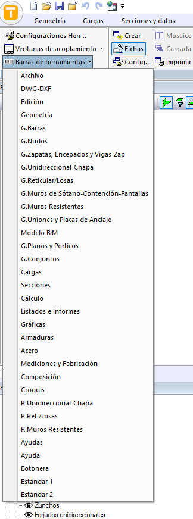

- Cualquier **icono** o **botón** (accesos directos a funciones), se encuentra en su correspondiente **Barra de herramientas**
- Por defecto la interface no muestra explícitamente ninguna **Barra de herramientas**
  - Pero desde **Ayudas>Ver>Barras de herramientas** podemos insertarlas y dejarlas a la vista
    - clic izq. sobre la barra de herramientas
      - la barra de herramientas aparece flotando (o situada)
        - podemos arrastrarla y situarla donde queramos y se nos permita
    - Lista de Barras de herramientas:
      - desde la pestaña **Ayudas>Ver**:

        - 

